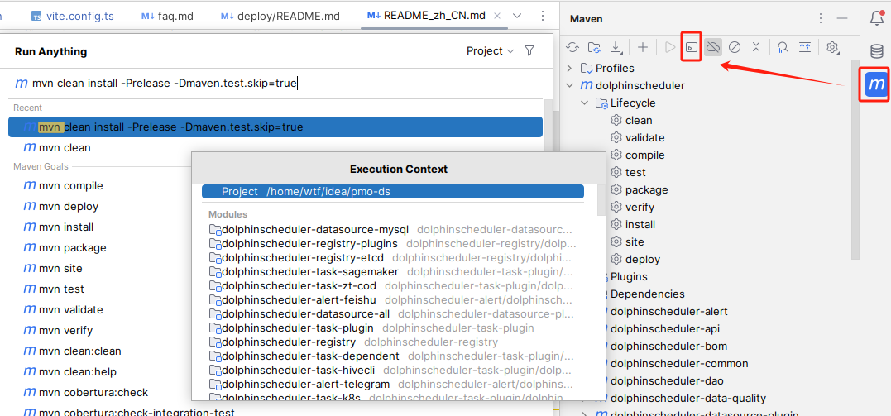

## 1. 后端打包

打包命令
```shell
mvn clean install -Prelease -Dmaven.test.skip=true
```
打包耗时至少十分钟，后续打包可以只打包更改的模块，然后替换libs下的jar包

### 需要部署的模块
+ master
+ api
+ worker
+ ui

打包完成后所在目录，以api为例
+ dolphinscheduler-api
  + target
    + api-server

### 脚本部署方式
dolphinscheduler项目整体启动脚本目录`./script`

其余安装部署参考  
https://dolphinscheduler.apache.org/zh-cn/docs/3.1.9/guide/installation/pseudo-cluster

## 前端部署
1. 打包前修改后端访问地址  
目录`dolphinscheduler-ui/.env.production`  
```txt
VITE_APP_PROD_WEB_URL='http://172.16.10.130:12345'
```  
为什么要打包前指定地址呢，那等于换机器我就得重新打包？因为不更改这个地址使用nginx也没用，有没有知道怎么解决的？后面我有个蠢办法。
2. 打包
```shell
pnpm install
如果报错执行
pnpm install node-sass --unsafe-perm
pnpm install
pnpm run build:prod
```
3. nginx使用docker启动
+ 在`nginx/html`目录下新建`/dolphinscheduler/ui/`,将`dolphinscheduler-ui/dist`下的内容拷贝进ui目录
+ `/nginx/conf/conf.d/`目录新建dsui.conf
```text
server {
    listen       8888;
    server_name  localhost;
    #charset koi8-r;
    
    #access_log  /var/log/nginx/host.access.log  main;
    location / {
        root /usr/share/nginx/html/dolphinscheduler/ui;
        index index.html index.htm;
        try_files $uri $uri/ /index.html;
    }
 
    location /dolphinscheduler/ui {
        root   /usr/share/nginx/html;
        index  index.html index.htm;
        try_files $uri $uri/ /index.html;
    }
 
    location /dolphinscheduler/ {
        proxy_pass http://172.16.10.130:12345;
    }
    #error_page  404              /404.html;
    # redirect server error pages to the static page /50x.html
    #
    error_page   500 502 503 504  /50x.html;
    location = /50x.html {
        root   /usr/share/nginx/html;
    }
}
```
+ 启动
```shell
docker run -p 9002:80 -p 8888:8888 --name nginx -v /opt/nginx/conf/nginx.conf:/etc/nginx/nginx.conf -v /opt/nginx/conf/conf.d:/etc/nginx/conf.d -v /opt/nginx/log:/var/log/nginx -v /opt/nginx/html:/usr/share/nginx/html -d nginx
```
### 前面提到的笨办法  
1. 进入ui目录，查找打包前配的地址
```shell
find . -type f -exec grep "http://127.0.0.1:12345" {} +
```
2. 替换，记得修改文件名
```shell
sed -i 's/http:\/\/127.0.0.1:12345/http:\/\/172.16.10.130:12345/g' ./assets/service.9f503a75.js
```
3. 重启nginx
